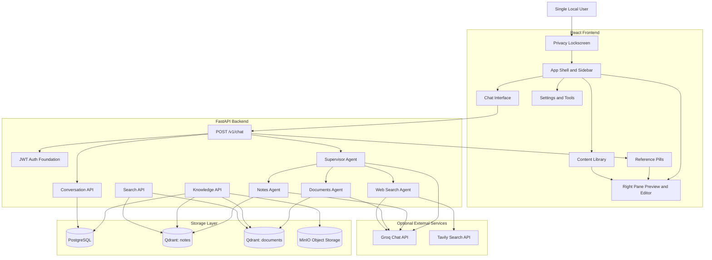
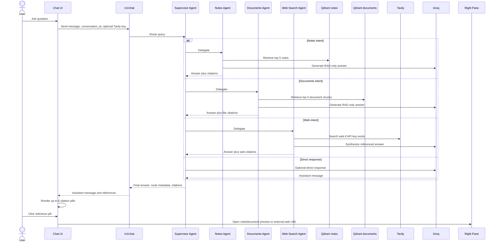
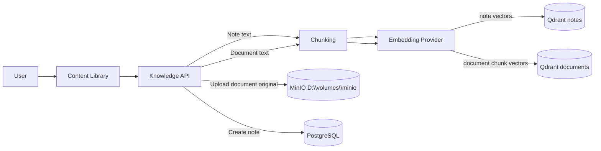
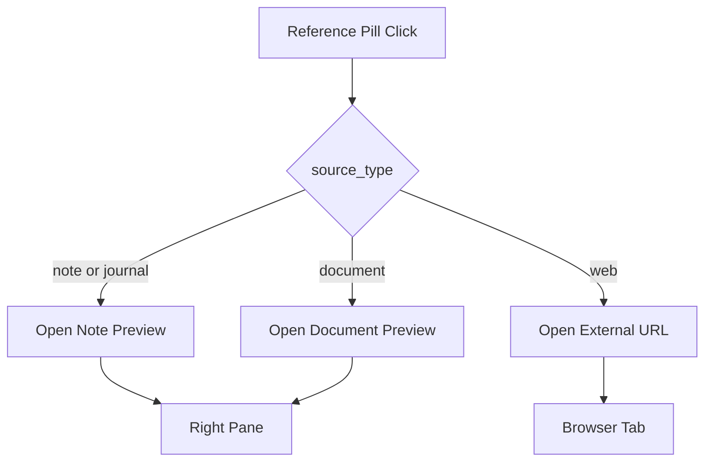
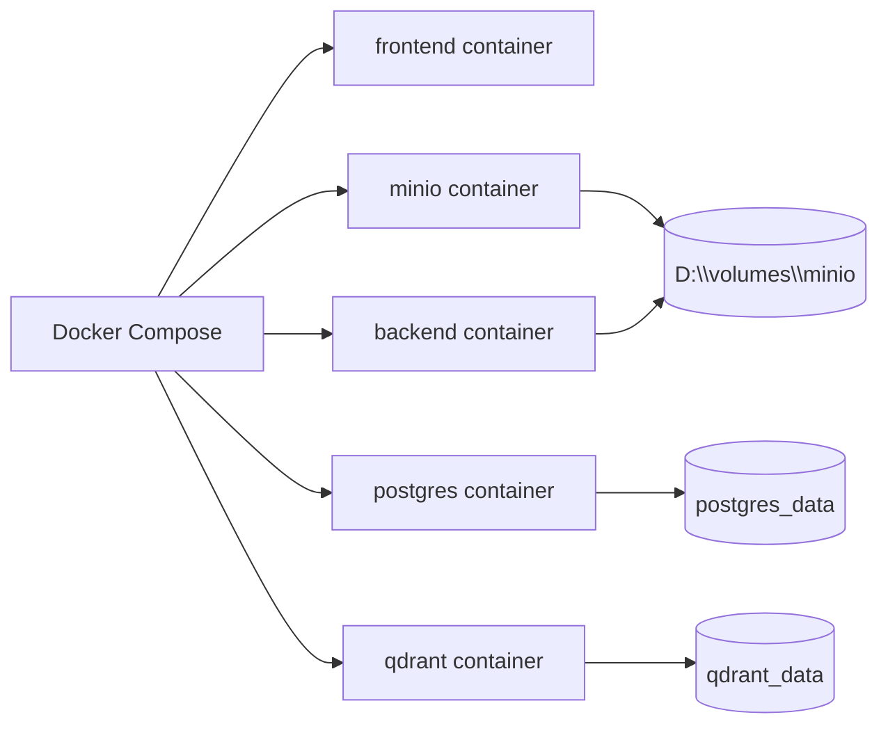

# MindMesh Architecture

This document describes the implementation architecture for the MindMesh app, including frontend, backend, authentication, content storage, vector retrieval, agents, and source-opening flows.

For icon-based Mermaid diagrams covering architecture, agentic routing, notes ingestion, document ingestion, and reference-opening flows, see [diagrams.md](./diagrams.md).

## System Overview

## Chat Retrieval and Reference Flow

## Content Ingestion Flow

## Source Opening Flow

## Main Components

### Frontend

- `AppShell`: navigation, sidebar, right pane host, profile/lock/settings entry points.
- `ProductivityWorkspace`: user-facing chat surface and reference rendering.
- `KnowledgeDashboard`: Library list, import actions, documents, notes, media, activity.
- `SettingsDialog`: provider settings, Tools/Tavily API key, prompts, security.
- `PrivacyLockscreen`: local PIN lock/unlock flow.

### Backend

- `ChatService`: persists messages and invokes `SupervisorAgent`.
- `SupervisorAgent`: routes queries and returns final response metadata.
- `NotesAgent`: retrieves from `notes` collection and answers only from context.
- `DocumentsAgent`: retrieves from `documents` collection and answers only from context.
- `WebSearchAgent`: uses Tavily only when an API key is available.
- `DocumentService`: stores originals in the MinIO volume path and indexes chunks in Qdrant.

## Data Isolation

- Every PostgreSQL row is owned by `user_id`.
- Every Qdrant payload includes `user_id`.
- Every retrieval filter must include `user_id`.
- MinIO object paths are namespaced by `user_id/document_id/file_name`.

## Deployment Services

