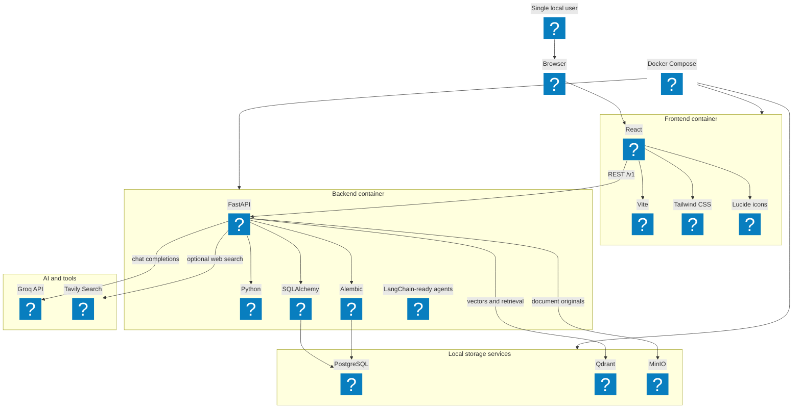
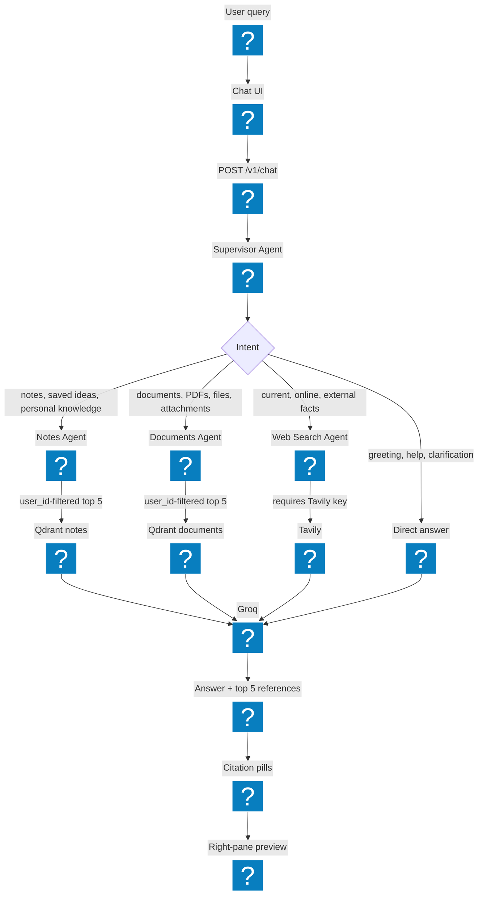
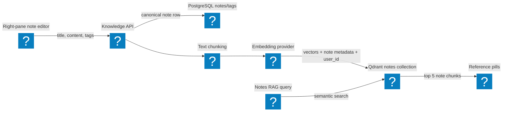
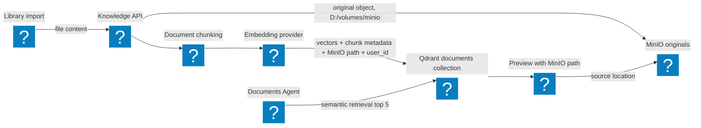
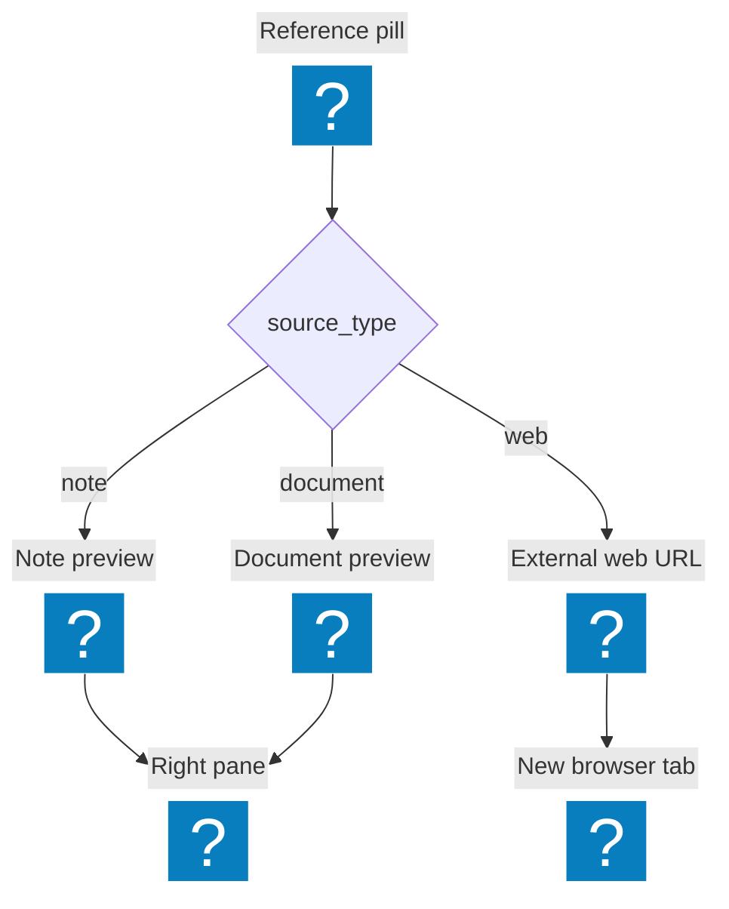

# MindMesh Mermaid Diagrams

These diagrams use Mermaid icon nodes with Iconify identifiers such as `logos:react`, `logos:fastapi-icon`, and `logos:postgresql`. Renderers need Mermaid icon support enabled. If a renderer does not support icon nodes, the labels still describe the technology role.

## Technology Architecture

## Agentic Routing Flow

## Notes Data Flow

## Document Data Flow

## Chat Reference Opening Flow

